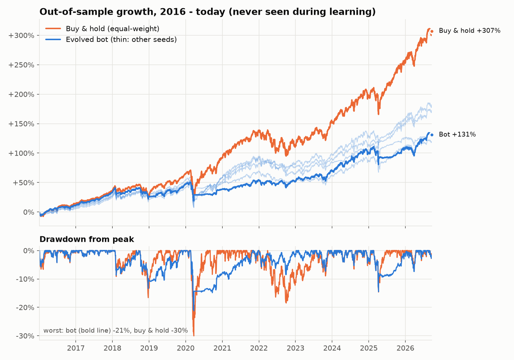
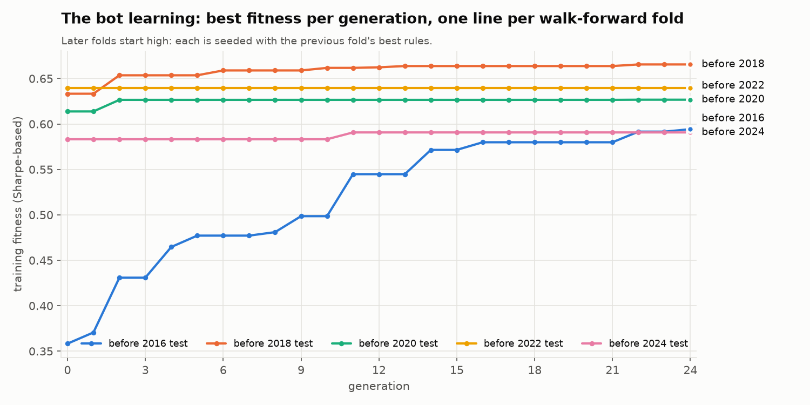
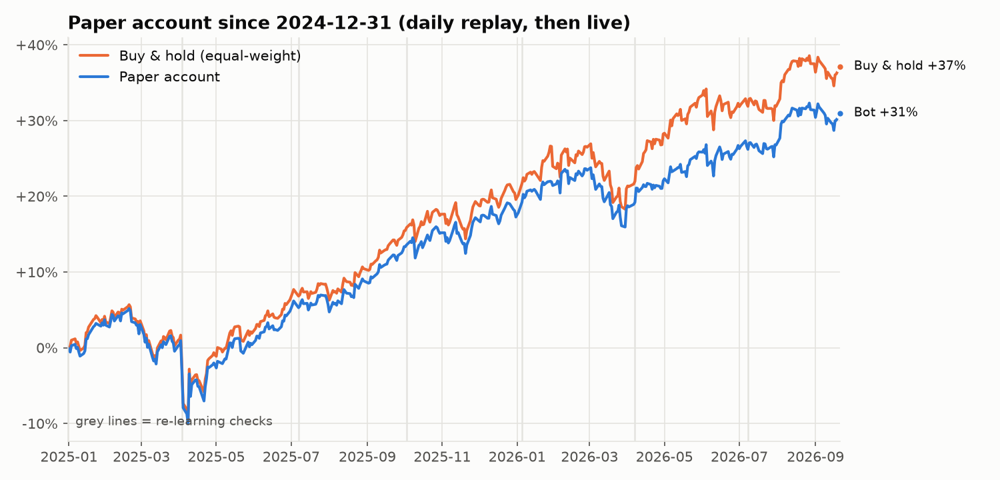

# EvoTrader

[](https://github.com/RafaelPF07/evotrader/actions/workflows/ci.yml)

A self-improving **paper trading** bot for US ETFs. It evolves its own trading strategies with genetic programming, can use a machine-learning signal as a building block, and trades a simulated account every day. It promotes a new strategy only when the strategy wins on data it has never seen. No real money is involved.

**The honest headline:** the learning works, in that it rediscovers a known market effect from scratch and improves across generations, but **it does not beat buy & hold**. This repository is about measuring that correctly: no look-ahead, costs always on, walk-forward testing, multiple random seeds, and every trade explained.



## Highlights

- **Genetic programming** over entry and exit rule trees, scored across 10 ETFs at once so that rules must generalise.
- **Walk-forward evaluation** (2016 to today, five 2-year test windows), repeated over **5 random seeds**, with the spread reported rather than the best run.
- **Purged, walk-forward ML signal** (gradient boosting). It is honestly reported as a coin flip, with AUC around 0.51.
- **Self-learning paper account.**
  - It runs every trading day and keeps a SQLite journal that explains each trade with live indicator values.
  - It analyses its losing trades for patterns and re-evolves quarterly.
  - It swaps strategies only on held-out evidence.
- **Leakage tests.** Tests scramble future prices and assert that no past decision, ML prediction or account entry changes. A live-only leak (Yahoo's partial intraday bar) was found and fixed.
- **Tooling.** 42 offline tests, CI on Python 3.12 and 3.13, a Streamlit dashboard, and a reproducible `uv` environment.

## Roadmap

- [x] **Phase 1: Foundation.** Data cache, look-ahead-proof backtester, costs, metrics, baseline strategies, tests.
- [x] **Phase 2: Learning engine.** Genetic programming over indicator rules, walk-forward ML signal, walk-forward validation.
- [x] **Phase 3: Paper trading loop.** Daily simulated broker, explained trade journal, mistake analysis, gated re-learning.
- [x] **Phase 4: Showcase.** Dashboard, charts, seed-robustness study, CI, [design Q&A](docs/DESIGN_QA.md).

## How the bot learns

A strategy is a **genome**: an entry rule and an exit rule, each a boolean expression tree over normalised features:

```
ENTRY (rsi(2) < 15.0 AND trend(200) > 0.010) | EXIT rsi(2) > 70.0
```

- **Building blocks.** RSI, z-score, momentum, distance from a moving average, moving-average spread, volatility, and `ml_prob`, the output of a gradient-boosting model. Every feature is scale-free, so one rule means the same thing on every ticker.
- **Evolution.** Tournament selection, subtree crossover, mutation (nudge a threshold, change a window, flip a comparison, grow or shrink the tree), elitism and random immigrants.
- **Fitness.** Scored across the whole universe at once: mean Sharpe, minus a penalty for inconsistency between tickers, rule complexity, and barely trading. This rewards rules that generalise rather than ones that fit a single lucky chart.
- **Selection.** The GA trains on the first 75% of the training window. The champion is picked from the hall of fame on the held-out last 25%.
- **Walk-forward.** An expanding training window, then 2-year test windows from 2016 to today that the process never sees. Each fold's hall of fame seeds the next fold, so the bot keeps building on what it learned.

### The ML signal

A `HistGradientBoostingClassifier` predicts whether a position opened at the next open is up 5 days later. It is refit every quarter on an expanding window. It is also **purged**: a label is known only 5 days after its date, so the model at day *t* trains only on rows up to *t − 6*. A test scrambles future prices and asserts that past probabilities don't change.

## Results (honest, out-of-sample)

Walk-forward over 2016 to Sep 2026: an equal-weight portfolio across 10 ETFs, costs included. Each test window was unseen by both evolution and champion selection. Because a genetic algorithm is a random search, the **whole evaluation was repeated with 5 seeds**. See [reports/walkforward.md](reports/walkforward.md) for per-fold details.

| strategy | CAGR | Sharpe | max drawdown |
|---|---|---|---|
| **evolved, mean of 5 seeds** (range) | **8.8%** (7.6 to 10.2) | **0.81** (0.74 to 0.92) | **-25.6%** (-21.2 to -30.0) |
| buy & hold | 14.0% | 0.96 | -30.1% |
| SMA 50/200 | 8.9% | 0.84 | -23.7% |
| momentum (6-month) | 8.1% | 0.91 | -14.4% |
| ML signal only | 5.5% | 0.60 | -23.3% |

**What this shows:**
- **No alpha.** No seed beat buy & hold on Sharpe. On average the evolved rules won 1.2 of 5 test periods, and they perform about as well as the classic baselines.
- **Slightly smaller drawdowns.** The average is -26% vs -30%, bought with about 25% less market exposure.
- **The search finds a real, stable pattern.** Across folds and seeds it converges on the same family of rules: *buy when price is well below its recent average (`zscore < -1.1`), exit when volatility spikes*. That is short-term mean reversion with a volatility filter, a well-documented effect.
- **The exact thresholds are not stable.** Small data revisions or a different seed change them, and per-period results swing with them. That is why this README reports a seed range rather than one lucky run, and why the live bot needs a margin before switching strategies.
- **The ML signal is a coin flip.** Its out-of-sample AUC is 0.50 to 0.52, and evolution never chose it. That is expected for daily direction prediction.
- **Nothing was tuned after seeing test results.** An earlier single run showed a much better drawdown (-15.5%). The multi-seed study showed that was luck, so this table replaced it.



## Paper trading loop

`evotrader paper run` processes every trading day since the last run, in the same order the backtester assumes:

1. **Fill.** Yesterday's orders execute at today's open, with slippage.
2. **Mark.** The account is valued at today's close.
3. **Learn.** Every 63 trading days:
   - **Study mistakes.** Replay the champion's trades and look for an entry-time condition that separated its losers from its winners (e.g. "losses clustered when `vol(20) > 0.31`"). Each lesson becomes a candidate rule: the champion plus that filter.
   - **Evolve.** Run the GA seeded with the champion, the lesson candidates and the hall of fame, on data that stops one year before today.
   - **Gate.** Promote the best challenger only if it beats the champion on that held-out final year by a margin. Otherwise keep what works.
4. **Decide.** The active rule queues orders for tomorrow. Every order stores *why*, with the live value of each condition:

```
WIN  GLD  2026-08-14 -> 2026-08-24  +6.45%
  why in : entry FIRED: rsi(2)=34.194 < 86.5 [yes] | exit quiet: trend(10)=0.022 > 0.037 [no]
  why out: entry quiet: rsi(2)=93.083 < 86.5 [no] | exit FIRED: trend(10)=0.041 > 0.037 [yes]
```

Everything (cash, positions, orders, journal, equity, strategy history, learning decisions) lives in one SQLite file, `data/paper.db`.

**Replay is honest.** `paper init --start 2025-01-02` trains the first champion only on data before that date, then `paper run` walks forward day by day. Tests check that:
- two worlds identical up to a cutoff produce byte-identical accounts (orders, fills, equity, learning decisions) up to that cutoff;
- the account reconciles to the cent (realised + unrealised P&L = equity change);
- a run split into chunks equals a single run.

Live runs also discard today's partial bar while the market is open.

### Replay results: Jan 2025 to Sep 2026



| | paper account | equal-weight buy & hold |
|---|---|---|
| return | +31.0% | +37.1% |
| Sharpe | 1.28 | |
| max drawdown | -14.4% | |
| closed trades | 64 (80% winners, avg +3.6%) | |

In all six re-learning rounds the champion was **kept**: no challenger beat it on unseen data by the required margin. Mistake analysis found no entry filter that would have removed more losing than winning return. The losers of this "stay invested, take profit on sharp spikes" rule look just like the winners at entry, which is itself a useful, honest result.

### Running it daily

`scripts/daily.ps1` runs the loop and appends to `logs/`. To schedule it on Windows after the US close (22:30 UK time):

```powershell
schtasks /Create /TN EvoTraderDaily /TR "powershell -ExecutionPolicy Bypass -File \"C:\Projects\Claude Project\scripts\daily.ps1\"" /SC WEEKLY /D MON,TUE,WED,THU,FRI /ST 22:30
```

## Dashboard

```bash
uv sync --extra dashboard
uv run evotrader dashboard
```

It has four tabs:
- **Paper account:** equity and drawdown against buy & hold, open positions and pending orders.
- **Trade journal:** every trade with filters and the reason it was taken.
- **Learning:** the active strategy and every re-learning decision.
- **Research:** walk-forward curves, the seed robustness study and learning curves.

Charts support hover and follow light or dark mode.

## Design principles

1. **No look-ahead.** Strategies decide at the close of day *t*, and orders fill at the open of day *t+1*. Tests scramble future prices and assert that no past decision, return or ML prediction changes.
2. **Costs are always on.** The default is 5 bps per side for commission, spread and slippage.
3. **Buy & hold is the bar to beat.** Every result is reported next to it.
4. **Survivorship-safe universe.** Broad ETFs rather than hand-picked winning stocks.
5. **Reproducible.** Every run is seeded, so the same seed gives the same evolved rules.

## Quick start

```bash
uv sync
uv run pytest
uv run evotrader backtest --ticker SPY           # baselines on one ticker
uv run evotrader compare                         # baselines across the universe
uv run evotrader ml                              # out-of-sample quality of the ML signal
uv run evotrader walkforward                     # the honest test of the learning process
uv run evotrader evolve                          # evolve on all history, save models/champion.json
uv run evotrader paper init --start 2025-01-02   # new paper account (past date = honest replay)
uv run evotrader paper run                       # trade every day since the last run
uv run evotrader paper status                    # equity, positions, strategy, learning log
uv run evotrader paper journal                   # closed trades and why they happened
uv run evotrader walkforward --seeds 5           # robustness across random seeds (~15 min)
uv run evotrader charts                          # regenerate docs/img
```

## Project layout

```
src/evotrader/
  data.py          # Yahoo Finance download + CSV cache + validation
  indicators.py    # SMA, EMA, RSI, momentum, z-score, volatility
  features.py      # Normalised feature catalogue + per-dataset feature cache
  ml.py            # Walk-forward, purged gradient-boosting signal
  strategies/      # Strategy interface and baseline strategies
  evolution/
    genome.py      # Rule trees, random generation, mutation, crossover
    fitness.py     # Multi-ticker fitness function
    engine.py      # The genetic algorithm
    strategy.py    # Genome -> Strategy adapter, save/load
  walkforward.py   # Fold construction, evaluation, markdown report
  paper/
    store.py       # SQLite account: positions, orders, journal, equity, learning log
    trader.py      # Daily loop: fill -> mark -> learn -> decide
    learner.py     # Mistake analysis, seeded re-evolution, promotion gate
    report.py      # Status and journal views
  backtest.py      # Execution simulation, costs, trade log
  metrics.py       # CAGR, Sharpe, Sortino, max drawdown, Calmar, ...
  charts.py        # README charts (matplotlib)
  dashboard.py     # Streamlit dashboard
  cli.py           # `evotrader` command
tests/             # Offline tests on synthetic data
reports/           # Generated walk-forward results
docs/              # Charts and design Q&A
```
